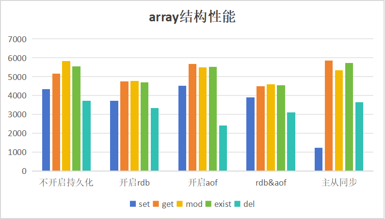
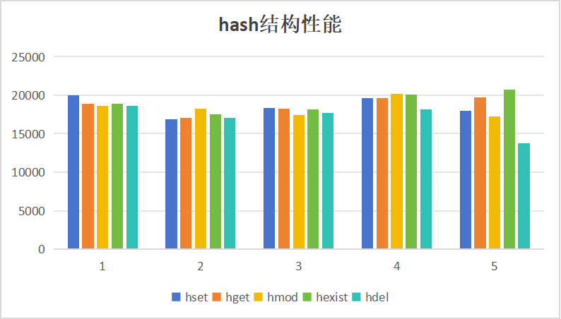
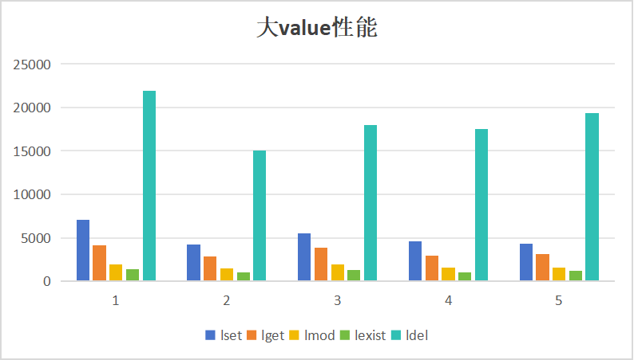

# KVStore


## 概要

 KVStore 是一个使用 C 语言编写的高性能键值数据库，定位于学习与实验场景。项目提供数组、红黑树、哈希等多种内存索引，包含“SET、GET、MOD、EXIST、DEL”五种操作，并可选择大 Value 外存管理，适合评估不同数据结构的延迟与内存占用。

网络层采用reactor网络模型和ntyco协程网络模型用以支持高并发场景，同时支持主从同步以及RDB和AOF两种持久化方式，可完整走通“写入-持久化-复制”链路，配合 kvs-client 和 testfiles 进行功能/压力测试。

## 目录结构

（列出主要目录与文件，并简短说明各自作用）

- `kvstore.c`:主函数入口，解析接收的数据帧存放入对应的数据结构
- `kvs_array.c`:处理数组结构存储
- `kvs_rbtree.c`:处理红黑树结构存储
- `kvs_hash.c`:处理哈希结构存储
- `reactor.c`: reactor网络模型
- `kvs_master_slave.c`:处理主从同步
- `data_files/`:存放持久化文件
- `testfiles/`:存放测试文件

## 功能与特性

- 数据结构：数组，红黑树，哈希表

- 网络模型：reactor，ntyco协程

- 数据帧协议：

  > #字符总数\r\n*cmd数量\r\n$cmd长度\r\ncmd内容\r\n 
  >
  > 例：
  >
  > #43\r\n*3\r\n$3\r\nSET\r\n$9\r\narray_K_0\r\n$9\r\narray_V_0\r\n
  >
  > 只接收符合格式的命令，过滤所有非法命令

- 功能： 

  > 数组命令
  >
  > `SET 'key' 'value'`: 存放key和value
  >
  > `GET 'key'`:查询key
  >
  > `MOD 'key' 'new value'`:修改key对应的value
  >
  > `EXIST 'key'`: 查询key是否存在
  >
  > `DEL 'key'`:删除键值对 
  >
  > 红黑树
  >
  > `RSET 'key' 'value'`: 存放key和value
  >
  > `RGET 'key'`:查询key
  >
  > `RMOD 'key' 'new value'`:修改key对应的value
  >
  > `REXIST 'key'`: 查询key是否存在
  >
  > `RDEL 'key'`:删除键值对
  >
  > 哈希表
  >
  > `HSET 'key' 'value'`: 存放key和value
  >
  > `HGET 'key'`:查询key
  >
  > `HMOD 'key' 'new value'`:修改key对应的value
  >
  > `HEXIST 'key'`: 查询key是否存在
  >
  > `HDEL 'key'`:删除键值对
  >
  > 大value键值对（存放到datafiles文件中，性能较低）
  >
  > `LSET 'key' 'value'`: 存放key和value
  >
  > `LGET 'key'`:查询key
  >
  > `LMOD 'key' 'new value'`:修改key对应的value
  >
  > `LEXIST 'key'`: 查询key是否存在
  >
  > `LDEL 'key'`:删除键值对

- RDB持久化：每隔一段时间将所有数据保存到rdb文件中，kvstore下次启动时可以读取rdb文件恢复数据
- AOF持久化：记录每一个接收到的’SET‘，’MOD‘，'DEL'命令到AOF文件中
- 主从同步：从节点启动时从主节点接收所有数据进行同步，后续主节点接收的数据会同步至从节点，从节点接收的数据也会同步至主节点
- 内存池：模仿jemalloc实现了一个内存池，开辟一整块内存划分给“8, 16, 32, 64, 128, 256, 512, 1024”大小的小内存碎片使用，大于1024的内存则直接malloc
- 大文件存储：大文件可以使用'L'命令存放到硬盘文件中，避免消耗大量内存

## 快速开始

### 依赖

- gcc
- liburing
- makefile

### 配置

- 配置文件：kvstore.conf
- 网络模型：reactor 或者ntyco
- 持久化：RDB、AOF

### 编译与清除编译文件

``` c
make
```

```c
make clean
```


### 启动示例

```
主节点：     ./kvstore master <port>
从节点:      ./kvstore slave <master ip> <port>
```

## 测试与基准

- 测试格式

> ```c
>  testcase <ip> <port> <datatype> <op> <count>
> ```
>
> 例： ./testcase 192.168.10.15 2000 array set 10000 测试array set 1万次
>
> 返回结果如下：
>
> Running array  set     count=10000
> array set -> 10000 ops, 597 ms, qps = 16750

- 测试结果（网络：reactor 单位：qps，数据量：100,000）










## 联系

1375803757@qq.com